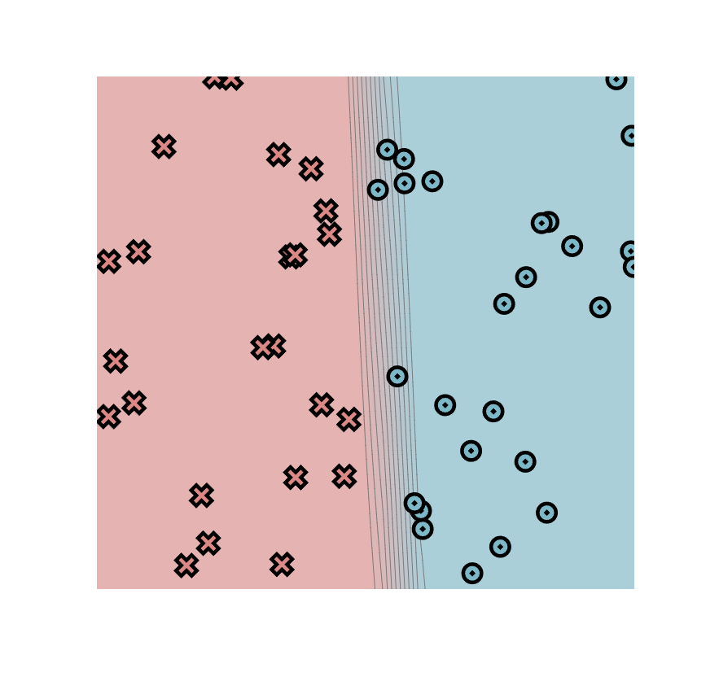
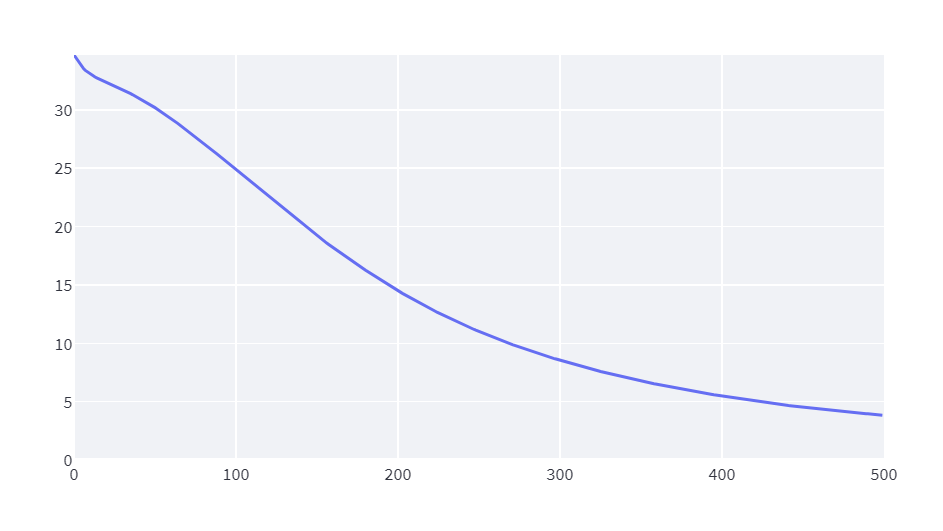
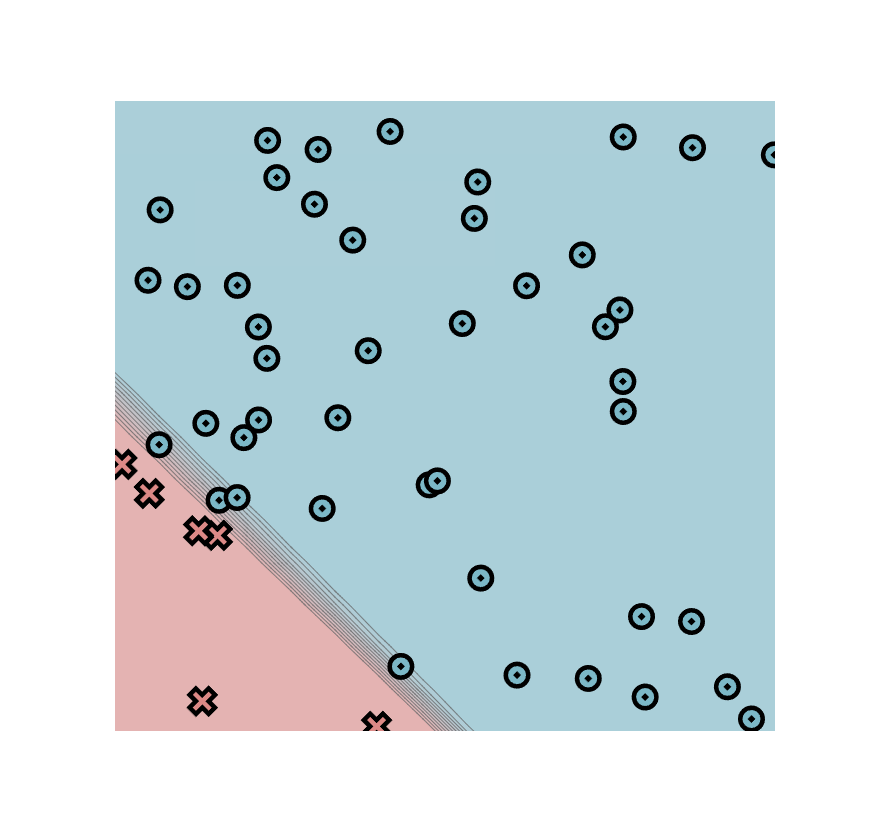
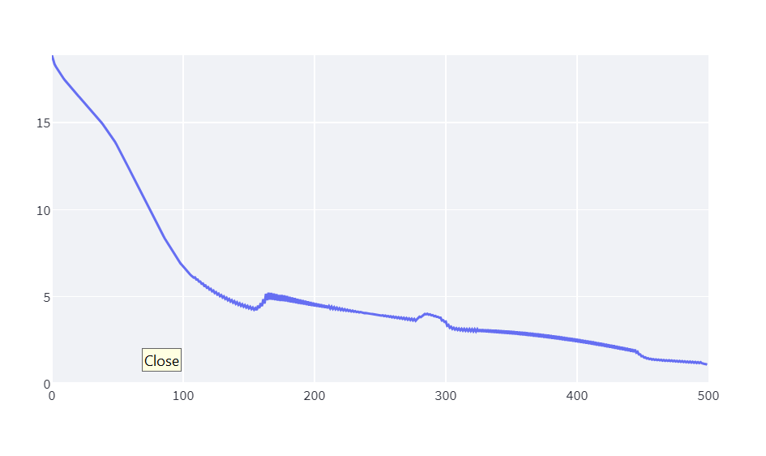
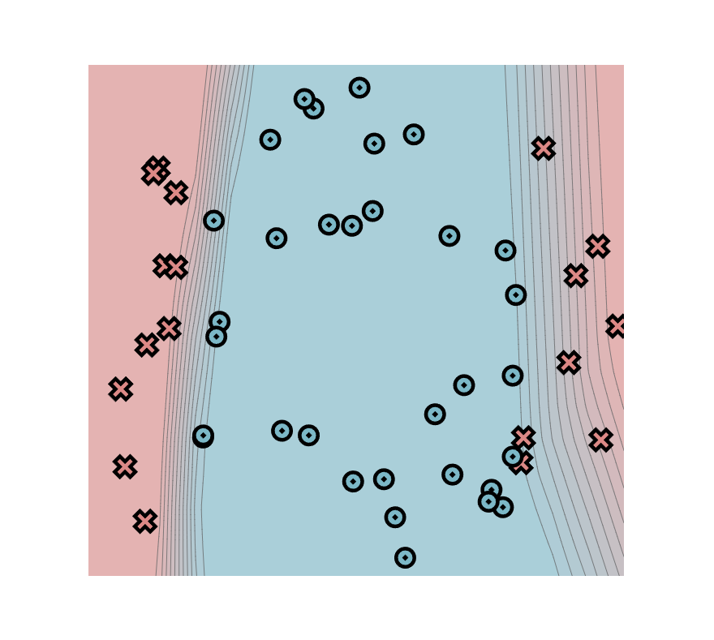
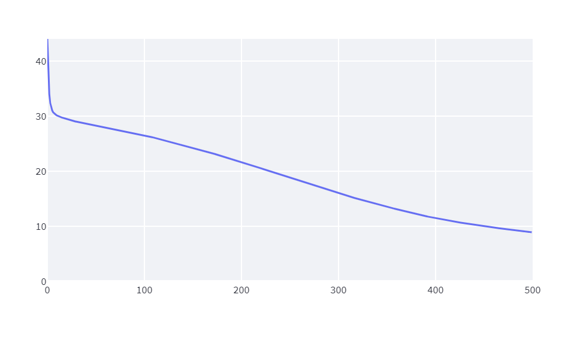
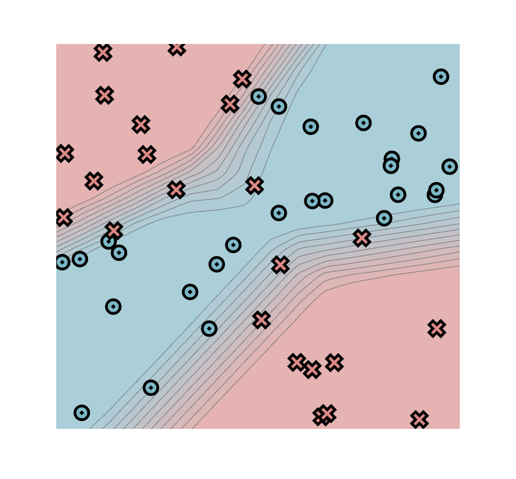
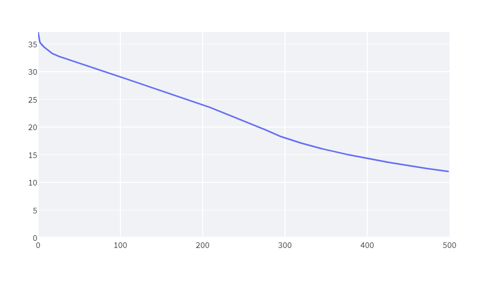

[](https://classroom.github.com/a/YFgwt0yY)
# MiniTorch Module 2


* Docs: https://minitorch.github.io/

* Overview: https://minitorch.github.io/module2/module2/

This assignment requires the following files from the previous assignments. You can get these by running

```bash
python sync_previous_module.py previous-module-dir current-module-dir
```

The files that will be synced are:

        minitorch/operators.py minitorch/module.py minitorch/autodiff.py minitorch/scalar.py minitorch/scalar_functions.py minitorch/module.py project/run_manual.py project/run_scalar.py project/datasets.py

# Task 2.5

## Simple Dataset

### Parameters
- Number of points: 50
- Size of hidden layer: 3
- learning rate: 0.1
- Number of epochs: 500

### Time per Epoch
Time per epoch: 0.082s.

### Final Image


### Loss Curve


### Training Log
```bash
Epoch: 0/500, loss: 0, correct: 0
Epoch: 10/500, loss: 33.13890918509425, correct: 26
Epoch: 20/500, loss: 32.43673862786164, correct: 38
Epoch: 30/500, loss: 31.79373548454981, correct: 41
Epoch: 40/500, loss: 31.082067650086216, correct: 41
Epoch: 50/500, loss: 30.273260431399216, correct: 44
Epoch: 60/500, loss: 29.34639097006921, correct: 45
Epoch: 70/500, loss: 28.313134251730446, correct: 45
Epoch: 80/500, loss: 27.23360434922317, correct: 44
Epoch: 90/500, loss: 26.1265622058142, correct: 47
Epoch: 100/500, loss: 24.9819193433564, correct: 48
Epoch: 110/500, loss: 23.809454155879262, correct: 48
Epoch: 120/500, loss: 22.65641697072264, correct: 48
Epoch: 130/500, loss: 21.515023119563093, correct: 48
Epoch: 140/500, loss: 20.387802010861392, correct: 48
Epoch: 150/500, loss: 19.308243105474915, correct: 48
Epoch: 160/500, loss: 18.280251760325374, correct: 48
Epoch: 170/500, loss: 17.296153403838783, correct: 49
Epoch: 180/500, loss: 16.348891617875594, correct: 49
Epoch: 190/500, loss: 15.443003348279735, correct: 50
Epoch: 200/500, loss: 14.583065695987006, correct: 50
Epoch: 210/500, loss: 13.781223797372228, correct: 50
Epoch: 220/500, loss: 13.024806316326723, correct: 50
Epoch: 230/500, loss: 12.326178424124535, correct: 50
Epoch: 240/500, loss: 11.671002507545959, correct: 50
Epoch: 250/500, loss: 11.061175549249146, correct: 50
Epoch: 260/500, loss: 10.491912542926995, correct: 50
Epoch: 270/500, loss: 9.962906912379205, correct: 50
Epoch: 280/500, loss: 9.474294023132549, correct: 50
Epoch: 290/500, loss: 9.015227993207311, correct: 50
Epoch: 300/500, loss: 8.584030981060518, correct: 50
Epoch: 310/500, loss: 8.17911345091735, correct: 50
Epoch: 320/500, loss: 7.7997309395639425, correct: 50
Epoch: 330/500, loss: 7.444608397348923, correct: 50
Epoch: 340/500, loss: 7.11109719204631, correct: 50
Epoch: 350/500, loss: 6.79784392214394, correct: 50
Epoch: 360/500, loss: 6.503556315665162, correct: 50
Epoch: 370/500, loss: 6.2272147595752205, correct: 50
Epoch: 380/500, loss: 5.968587332369426, correct: 50
Epoch: 390/500, loss: 5.725348502770897, correct: 50
Epoch: 400/500, loss: 5.496341342979037, correct: 50
Epoch: 410/500, loss: 5.28098071799573, correct: 50
Epoch: 420/500, loss: 5.077762719896523, correct: 50
Epoch: 430/500, loss: 4.886404572747423, correct: 50
Epoch: 440/500, loss: 4.708331650522341, correct: 50
Epoch: 450/500, loss: 4.541256806262782, correct: 50
Epoch: 460/500, loss: 4.3844487123879485, correct: 50
Epoch: 470/500, loss: 4.2362134699048895, correct: 50
Epoch: 480/500, loss: 4.096264903620355, correct: 50
Epoch: 490/500, loss: 3.96526833139372, correct: 50
Epoch: 500/500, loss: 3.8418819815594705, correct: 50

```

## Diag Dataset

### Parameters
- Number of points: 50
- Size of hidden layer: 4
- learning rate: 0.5
- Number of epochs: 500

### Time per Epoch
Time per epoch: 0.154s.

### Final Image


### Loss Curve


### Training Log
```bash
Epoch: 0/500, loss: 0, correct: 0
Epoch: 10/500, loss: 17.520041849841093, correct: 44
Epoch: 20/500, loss: 16.625008407341667, correct: 44
Epoch: 30/500, loss: 15.785897672200239, correct: 44
Epoch: 40/500, loss: 14.880481697381471, correct: 44
Epoch: 50/500, loss: 13.771617192990222, correct: 44
Epoch: 60/500, loss: 12.318930318288052, correct: 44
Epoch: 70/500, loss: 10.818408142642799, correct: 44
Epoch: 80/500, loss: 9.329106928526416, correct: 45
Epoch: 90/500, loss: 7.950486562455394, correct: 45
Epoch: 100/500, loss: 6.821508886889805, correct: 46
Epoch: 110/500, loss: 6.106083589420021, correct: 46
Epoch: 120/500, loss: 5.545592069297918, correct: 48
Epoch: 130/500, loss: 5.095198438053911, correct: 48
Epoch: 140/500, loss: 4.737337716298487, correct: 49
Epoch: 150/500, loss: 4.46569651663597, correct: 49
Epoch: 160/500, loss: 4.631426151434382, correct: 48
Epoch: 170/500, loss: 5.182985442154489, correct: 46
Epoch: 180/500, loss: 5.03642593141139, correct: 46
Epoch: 190/500, loss: 4.839541601630714, correct: 46
Epoch: 200/500, loss: 4.659059180641034, correct: 47
Epoch: 210/500, loss: 4.493500032676438, correct: 48
Epoch: 220/500, loss: 4.340358053801138, correct: 48
Epoch: 230/500, loss: 4.197654540944376, correct: 48
Epoch: 240/500, loss: 4.063792802951288, correct: 48
Epoch: 250/500, loss: 3.937456727276905, correct: 48
Epoch: 260/500, loss: 3.8175397553663966, correct: 48
Epoch: 270/500, loss: 3.703093231241581, correct: 48
Epoch: 280/500, loss: 3.775577226895905, correct: 48
Epoch: 290/500, loss: 3.929239435961227, correct: 48
Epoch: 300/500, loss: 3.5521416504885925, correct: 48
Epoch: 310/500, loss: 3.0871691904232446, correct: 49
Epoch: 320/500, loss: 3.0234868836264903, correct: 49
Epoch: 330/500, loss: 2.976237161758701, correct: 49
Epoch: 340/500, loss: 2.922694475405448, correct: 49
Epoch: 350/500, loss: 2.8594512645513124, correct: 49
Epoch: 360/500, loss: 2.785839069390073, correct: 49
Epoch: 370/500, loss: 2.7022950470932208, correct: 49
Epoch: 380/500, loss: 2.6096895365153263, correct: 49
Epoch: 390/500, loss: 2.508800971789942, correct: 49
Epoch: 400/500, loss: 2.3999631173802563, correct: 49
Epoch: 410/500, loss: 2.2829401112333785, correct: 49
Epoch: 420/500, loss: 2.1571200490733675, correct: 49
Epoch: 430/500, loss: 2.022231175924747, correct: 49
Epoch: 440/500, loss: 1.8797903562206177, correct: 49
Epoch: 450/500, loss: 1.5786930651250548, correct: 50
Epoch: 460/500, loss: 1.3707930469144194, correct: 50
Epoch: 470/500, loss: 1.309605412112608, correct: 50
Epoch: 480/500, loss: 1.257655967243689, correct: 50
Epoch: 490/500, loss: 1.2075309608333655, correct: 50
Epoch: 500/500, loss: 1.1041541922919527, correct: 50

```

## Split Dataset

### Parameters
- Number of points: 50
- Size of hidden layer: 6
- learning rate: 0.1
- Number of epochs: 500

### Time per Epoch
Time per epoch: 0.239s.

### Final Image


### Loss Curve


### Training Log
```bash
Epoch: 0/500, loss: 0, correct: 0
Epoch: 10/500, loss: 30.216793253099944, correct: 36
Epoch: 20/500, loss: 29.512507983800543, correct: 36
Epoch: 30/500, loss: 29.0208684191105, correct: 40
Epoch: 40/500, loss: 28.67908274481442, correct: 42
Epoch: 50/500, loss: 28.355051746060653, correct: 42
Epoch: 60/500, loss: 28.025094257448583, correct: 42
Epoch: 70/500, loss: 27.682109783702856, correct: 42
Epoch: 80/500, loss: 27.321995109859923, correct: 42
Epoch: 90/500, loss: 26.942438248249974, correct: 42
Epoch: 100/500, loss: 26.54283088784687, correct: 42
Epoch: 110/500, loss: 26.119211014813295, correct: 42
Epoch: 120/500, loss: 25.67521000855392, correct: 42
Epoch: 130/500, loss: 25.235149617079966, correct: 42
Epoch: 140/500, loss: 24.77972163533736, correct: 42
Epoch: 150/500, loss: 24.3066467333693, correct: 42
Epoch: 160/500, loss: 23.814161459539324, correct: 42
Epoch: 170/500, loss: 23.305203170708527, correct: 42
Epoch: 180/500, loss: 22.779420812981023, correct: 42
Epoch: 190/500, loss: 22.237838846222953, correct: 42
Epoch: 200/500, loss: 21.694001971978494, correct: 42
Epoch: 210/500, loss: 21.13942137429869, correct: 42
Epoch: 220/500, loss: 20.5795397396431, correct: 42
Epoch: 230/500, loss: 20.011791401094673, correct: 42
Epoch: 240/500, loss: 19.440829076173586, correct: 42
Epoch: 250/500, loss: 18.867828657242892, correct: 43
Epoch: 260/500, loss: 18.294266538361825, correct: 43
Epoch: 270/500, loss: 17.72490022329745, correct: 43
Epoch: 280/500, loss: 17.161386340404487, correct: 45
Epoch: 290/500, loss: 16.603417338556206, correct: 45
Epoch: 300/500, loss: 16.05850210996464, correct: 46
Epoch: 310/500, loss: 15.52781842710812, correct: 47
Epoch: 320/500, loss: 15.012737525226509, correct: 47
Epoch: 330/500, loss: 14.51520809910721, correct: 47
Epoch: 340/500, loss: 14.038188061782789, correct: 47
Epoch: 350/500, loss: 13.581385664178027, correct: 47
Epoch: 360/500, loss: 13.125036465981768, correct: 47
Epoch: 370/500, loss: 12.678551682527987, correct: 47
Epoch: 380/500, loss: 12.250511532949902, correct: 47
Epoch: 390/500, loss: 11.85546074765718, correct: 48
Epoch: 400/500, loss: 11.50694507782533, correct: 48
Epoch: 410/500, loss: 11.176323645383668, correct: 48
Epoch: 420/500, loss: 10.864777067747957, correct: 48
Epoch: 430/500, loss: 10.570356050920656, correct: 48
Epoch: 440/500, loss: 10.29338764521603, correct: 48
Epoch: 450/500, loss: 10.031189747265978, correct: 48
Epoch: 460/500, loss: 9.783725468585521, correct: 48
Epoch: 470/500, loss: 9.547958068339561, correct: 48
Epoch: 480/500, loss: 9.324689522589326, correct: 48
Epoch: 490/500, loss: 9.11354887842, correct: 48
Epoch: 500/500, loss: 8.914501028451513, correct: 48
```

## Xor Dataset

### Parameters
- Number of points: 50
- Size of hidden layer:10
- learning rate: 0.1
- Number of epochs: 500

### Time per Epoch
Time per epoch: 0.249s.

### Final Image


### Loss Curve


### Training Log
```bash
Epoch: 0/500, loss: 0, correct: 0
Epoch: 10/500, loss: 34.238021232696575, correct: 35
Epoch: 20/500, loss: 33.166826080262396, correct: 35
Epoch: 30/500, loss: 32.58720856920693, correct: 36
Epoch: 40/500, loss: 32.10863776117294, correct: 36
Epoch: 50/500, loss: 31.62132620858481, correct: 36
Epoch: 60/500, loss: 31.12433355372634, correct: 34
Epoch: 70/500, loss: 30.633322879468356, correct: 34
Epoch: 80/500, loss: 30.12149959809241, correct: 33
Epoch: 90/500, loss: 29.612942720504222, correct: 33
Epoch: 100/500, loss: 29.11254153210204, correct: 34
Epoch: 110/500, loss: 28.613933949940066, correct: 34
Epoch: 120/500, loss: 28.114466086629957, correct: 34
Epoch: 130/500, loss: 27.61339864950673, correct: 37
Epoch: 140/500, loss: 27.115796991382382, correct: 37
Epoch: 150/500, loss: 26.62212919260663, correct: 37
Epoch: 160/500, loss: 26.13278579533783, correct: 38
Epoch: 170/500, loss: 25.634637416586873, correct: 40
Epoch: 180/500, loss: 25.130531692113042, correct: 39
Epoch: 190/500, loss: 24.624873381643987, correct: 39
Epoch: 200/500, loss: 24.09814699095582, correct: 39
Epoch: 210/500, loss: 23.54866668074344, correct: 39
Epoch: 220/500, loss: 22.95319576331912, correct: 39
Epoch: 230/500, loss: 22.379746049554566, correct: 39
Epoch: 240/500, loss: 21.802063043775647, correct: 39
Epoch: 250/500, loss: 21.203488355744984, correct: 40
Epoch: 260/500, loss: 20.59897983822762, correct: 40
Epoch: 270/500, loss: 19.973639056422172, correct: 40
Epoch: 280/500, loss: 19.32498377770114, correct: 42
Epoch: 290/500, loss: 18.609511037829726, correct: 44
Epoch: 300/500, loss: 18.078733088751136, correct: 45
Epoch: 310/500, loss: 17.59105506984028, correct: 44
Epoch: 320/500, loss: 17.13432046533079, correct: 44
Epoch: 330/500, loss: 16.711241912566674, correct: 44
Epoch: 340/500, loss: 16.316767996093365, correct: 44
Epoch: 350/500, loss: 15.943787226442062, correct: 45
Epoch: 360/500, loss: 15.596862598414486, correct: 45
Epoch: 370/500, loss: 15.265754624418227, correct: 45
Epoch: 380/500, loss: 14.948934249321445, correct: 45
Epoch: 390/500, loss: 14.645386905426959, correct: 45
Epoch: 400/500, loss: 14.356051770526731, correct: 45
Epoch: 410/500, loss: 14.074877518189961, correct: 45
Epoch: 420/500, loss: 13.807477131265665, correct: 45
Epoch: 430/500, loss: 13.547369659514333, correct: 45
Epoch: 440/500, loss: 13.297060839376964, correct: 45
Epoch: 450/500, loss: 13.054753564849658, correct: 45
Epoch: 460/500, loss: 12.820413253216264, correct: 45
Epoch: 470/500, loss: 12.594195635845441, correct: 45
Epoch: 480/500, loss: 12.374303742203166, correct: 45
Epoch: 490/500, loss: 12.164553320145785, correct: 45
Epoch: 500/500, loss: 11.970918976036776, correct: 45
```